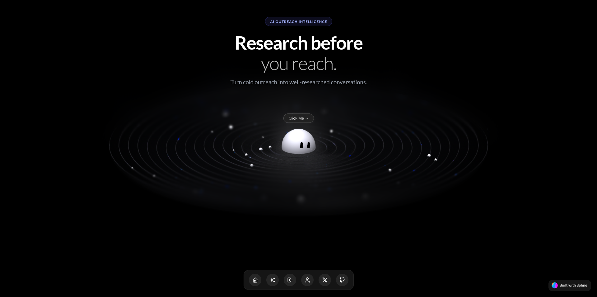
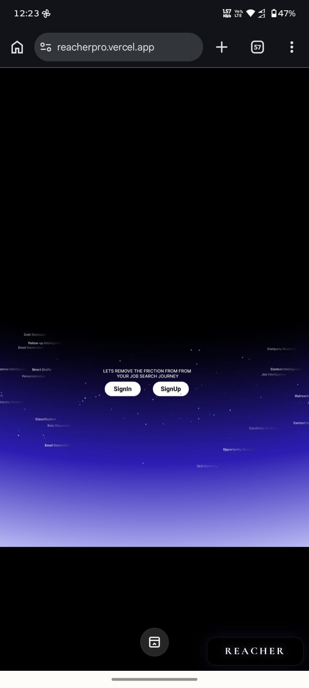

<div align="center">

# REACHER

### Research before you reach.

Reacher turns a job description, a candidate profile, and a target company into a researched, reviewable outreach draft.

<p>
  <a href="https://reacherpro.vercel.app/"><strong>Open the app</strong></a>
  &nbsp;|&nbsp;
  <a href="#getting-started">Run locally</a>
  &nbsp;|&nbsp;
  <a href="#architecture">Understand the system</a>
</p>


</div>

---

## What Reacher does

Good outreach starts before the email is written. Reacher gives the message the context it needs by moving through a focused workflow:

1. Add a prospect, their contact email, and the role or job description.
2. Analyze the role requirements.
3. Compare those requirements with your professional profile.
4. Research the target company for a useful, current angle.
5. Generate a concise, personalized email.
6. Review the draft, copy it, or save it to Gmail Drafts when your account has beta access.

The product is deliberately human-in-the-loop. Reacher prepares the research and the first draft; you decide what is accurate and what is ready to send.



<div align="center">
  
</div>

## Product capabilities

| Capability | What it provides |
| --- | --- |
| Candidate profile | Name, contact details, headline, skills, projects, experience, education, and social links. |
| Resume sharing | Upload a PDF and create an unguessable Reacher link that can be included in outreach. |
| Job description analysis | Extracts required skills, preferred skills, responsibilities, seniority, and keywords. |
| Candidate analysis | Identifies strong matches, relevant projects, and potential gaps from the profile data. |
| Company research | Uses web and Wikipedia search tools to find company context, product focus, and recent hooks. |
| Outreach writing | Produces a short, direct email with a subject line and real profile links only. |
| Draft review | Scores the email and returns tone, length, alignment, and actionable feedback. |
| Gmail integration | Creates a Gmail draft through Clerk's Google OAuth connection. Reacher never sends the email automatically. |
| Private beta access | Everyone can explore the workflow and generate messages. Automatic Gmail draft saving is currently reserved for trusted or added beta users. |

## The outreach pipeline

When a new flow is created, the backend starts the pipeline in the background and stores progress in MongoDB so the dashboard can poll for updates.

```text
Prospect input
     |
     v
Job description analysis ----+
                              |
Candidate profile analysis --+--> Company research --> Email draft --> Review --> Gmail Drafts
```

Each stage can also be run independently from the dashboard. Existing results are cached to avoid repeating an AI call unnecessarily.

## Architecture

```text
                         +----------------------+
                         |   React + Vite app   |
                         |  BrowserRouter + UI  |
                         +----------+-----------+
                                    |
                           Clerk session token
                                    |
                         +----------v-----------+
                         |     FastAPI API      |
                         | auth, flows, agents  |
                         +----+------------+----+
                              |            |
                    +---------v--+     +---v-----------+
                    | MongoDB    |     | Appwrite      |
                    | profiles   |     | resume PDFs   |
                    | campaigns  |     +---------------+
                    +------------+
                              |
                    +---------v----------+
                    | Gemini AI agents   |
                    | analyze, research,|
                    | write, review      |
                    +--------------------+
                              |
                    +---------v----------+
                    | Gmail API          |
                    | draft creation     |
                    +--------------------+
```

### Repository layout

```text
reacher/
├── frontend/
│   ├── src/
│   │   ├── App.tsx                    # Auth-aware route tree
│   │   ├── main.tsx                   # ClerkProvider + BrowserRouter
│   │   ├── components/
│   │   │   ├── Dashboard.tsx          # Main workspace and Gmail settings
│   │   │   ├── OutreachForm.tsx       # Flow creation and pipeline controls
│   │   │   ├── ProfileForm.tsx         # Candidate profile and resume upload
│   │   │   ├── AuthLayout.tsx          # Shared sign-in/sign-up shell
│   │   │   └── clerkAppearance.ts      # Shared Clerk visual configuration
│   │   ├── assets/sign-up.png          # Authentication artwork
│   │   └── index.css                   # Product and auth styling
│   ├── vercel.json                     # SPA rewrite for deep links
│   ├── vite.config.ts
│   └── package.json
├── backend/
│   ├── app/
│   │   ├── main.py                     # FastAPI application
│   │   ├── agents/                     # JD, candidate, research, writer, reviewer
│   │   ├── api/routes/                 # Profile, outreach, Gmail, public resume APIs
│   │   ├── services/                   # Pipeline, profile, outreach, Gmail services
│   │   └── schemas/                    # Pydantic request and response models
│   ├── requirements.txt
│   ├── Dockerfile
│   └── .env.example
└── README.md
```

## Tech stack

| Layer | Technology |
| --- | --- |
| Frontend | React 19, TypeScript, Vite 8, Tailwind CSS 4 |
| Routing | React Router with `BrowserRouter` |
| Authentication | Clerk React SDK and Clerk Google OAuth |
| Backend | FastAPI, Python 3.11+ |
| Database | MongoDB with the async PyMongo client |
| File storage | Appwrite Storage |
| AI | Google Gemini via the Google GenAI SDK |
| Email | Gmail API, draft creation only |
| Frontend hosting | Vercel |

## Getting started

### Prerequisites

- Node.js 18 or newer
- Python 3.11 or newer
- A Clerk application
- A MongoDB database
- A Gemini API key
- An Appwrite project and storage bucket for resume PDFs
- Google OAuth configured in Clerk if Gmail drafts are required

### 1. Configure the backend

```bash
cd backend
python -m venv .venv
source .venv/bin/activate
pip install -r requirements.txt
cp .env.example .env
```

Fill in `backend/.env`:

```env
CLERK_SECRET_KEY=sk_...

MONGODB_URL=mongodb+srv://...
MONGODB_DATABASE=reacher

APPWRITE_ENDPOINT=https://cloud.appwrite.io/v1
APPWRITE_PROJECT_ID=...
APPWRITE_API_KEY=...
APPWRITE_BUCKET_ID=...

GEMINI_API_KEY=...

# The public backend origin used in resume links sent to recipients.
PUBLIC_API_URL=http://localhost:8000
```

Start the API from the `backend` directory:

```bash
uvicorn app.main:app --reload --port 8000
```

The API is available at `http://localhost:8000`.

Interactive API documentation is available at `http://localhost:8000/docs`.

### 2. Configure the frontend

Create `frontend/.env.local`:

```env
VITE_CLERK_PUBLISHABLE_KEY=pk_...
VITE_API_URL=http://localhost:8000
```

Install dependencies and start Vite:

```bash
cd frontend
npm install
npm run dev
```

Open `http://localhost:5173`.

### 3. Verify the setup

Check the backend:

```bash
curl http://localhost:8000/api/health
```

Build and preview the frontend production bundle:

```bash
cd frontend
npm run build
npm run preview
```

Available frontend routes:

| Route | Purpose |
| --- | --- |
| `/` | Public landing page, or the dashboard for a signed-in user |
| `/sign-in` | Clerk sign-in flow |
| `/sign-up` | Clerk sign-up flow |
| `/about` | Product overview |

## API surface

Authenticated routes require a Clerk bearer session token.

| Method | Endpoint | Purpose | Auth |
| --- | --- | --- | --- |
| `GET` | `/api/health` | Database-backed service health check | Public |
| `GET` | `/api/profile` | Read the current candidate profile | Clerk |
| `PUT` | `/api/profile` | Update the current candidate profile | Clerk |
| `POST` | `/api/profile/resume` | Upload a PDF resume, max 5 MB | Clerk |
| `GET` | `/api/outreach` | List the current user's flows | Clerk |
| `POST` | `/api/outreach` | Create a flow and start the background pipeline | Clerk |
| `POST` | `/api/outreach/{id}/analyze-jd` | Analyze the job description | Clerk |
| `POST` | `/api/outreach/{id}/analyze-candidate` | Analyze the candidate profile | Clerk |
| `POST` | `/api/outreach/{id}/research-company` | Research the target company | Clerk |
| `POST` | `/api/outreach/{id}/generate-draft` | Generate or upgrade the outreach draft | Clerk |
| `POST` | `/api/outreach/{id}/review-draft` | Review the generated email | Clerk |
| `GET` | `/api/gmail/status` | Check the connected Gmail account | Clerk |
| `POST` | `/api/gmail/draft` | Create a Gmail draft | Clerk |
| `GET` | `/api/public/resume/{token}` | View a tokenized resume PDF | Public token |

## Resume links and privacy

Resume uploads are stored in Appwrite. Reacher stores only resume metadata plus a SHA-256 hash of an unguessable access token in MongoDB.

- Email recipients receive a Reacher URL, not an Appwrite storage URL.
- The public URL serves the PDF inline and does not expose internal file IDs or API keys.
- Replacing a resume creates a new token, which invalidates the previous link.
- The link is intentionally public to the recipient who has it. Do not include confidential information in a resume you share externally.
- Set `PUBLIC_API_URL` to the deployed backend origin in production so links remain correct for older profiles and background jobs.

## Gmail and private beta access

Reacher uses Clerk's Google OAuth connection and the Gmail compose scope to create drafts. It does not send emails on the user's behalf.

During the private beta:

- New or untrusted users can still complete research and generate or copy email messages.
- Automatic Gmail Drafts creation is intended for trusted users added to the beta.
- Users who need full access should contact Shivam through the link shown on the authentication screens.

Before production use, configure the Google OAuth consent screen, authorized origins, and Clerk external account settings for the deployment domain.

## Deploying the frontend to Vercel

The Vite app uses `BrowserRouter`, so the Vercel project must treat `frontend/` as its Root Directory.

Recommended Vercel settings:

```text
Root Directory: frontend
Framework Preset: Vite
Build Command: npm run build
Output Directory: dist
```

`frontend/vercel.json` rewrites unknown frontend paths to `index.html`. This keeps direct visits, refreshes, Back, and Forward navigation working for `/sign-in`, `/sign-up`, and `/about` without replacing the client-side router.

Set these Vercel environment variables:

```env
VITE_CLERK_PUBLISHABLE_KEY=pk_...
VITE_API_URL=https://your-backend.example.com
```

## Deploying the backend

The backend includes a production Dockerfile based on Python 3.11. It starts FastAPI with Uvicorn on port `7860` by default:

```bash
cd backend
docker build -t reacher-api .
docker run --env-file .env -p 7860:7860 reacher-api
```

For a managed host, configure the service with the same environment variables from `backend/.env.example`, expose the service publicly, and set the frontend `VITE_API_URL` to that origin.

Remember to allow the deployed frontend origin in the backend CORS configuration and Clerk's authorized parties list when deploying under a new domain.

## Development notes

- `npm run build` runs TypeScript's project build and then creates the Vite production bundle.
- `npm run lint` runs the frontend ESLint configuration.
- AI agents require `GEMINI_API_KEY` at runtime.
- The background pipeline writes `pipeline_status` and `pipeline_error` fields so the dashboard can show progress and failures.
- Empty dashboards intentionally show no fabricated prospects or mock flows.
- Gmail draft creation can fail independently of AI generation; the generated draft remains available in Reacher when Gmail is unavailable.

## Roadmap

- [x] Clerk authentication with shared sign-in and sign-up experience
- [x] Candidate profile and PDF resume upload
- [x] Tokenized resume links for outreach
- [x] Job description, candidate, and company analysis
- [x] Personalized email generation and review
- [x] Gmail Drafts integration for trusted beta users
- [x] Responsive dashboard and authentication screens
- [x] Vercel SPA fallback for direct client-side routes
- [ ] More advanced contact discovery and enrichment
- [ ] Optional outreach scheduling
- [ ] Reply and outcome tracking
- [ ] Rich HTML email composition
- [ ] Per-flow controls for resume-link inclusion

## Contributing

Keep changes focused on the product workflow they affect. Before opening a pull request:

```bash
cd frontend
npm run build
npm run lint
```

For backend changes, run the API locally and exercise the affected endpoint with a valid Clerk session. Never commit `.env`, API keys, OAuth tokens, or private resume files.

<div align="center">

Built for thoughtful outreach.

REACHER - Private beta

</div>
